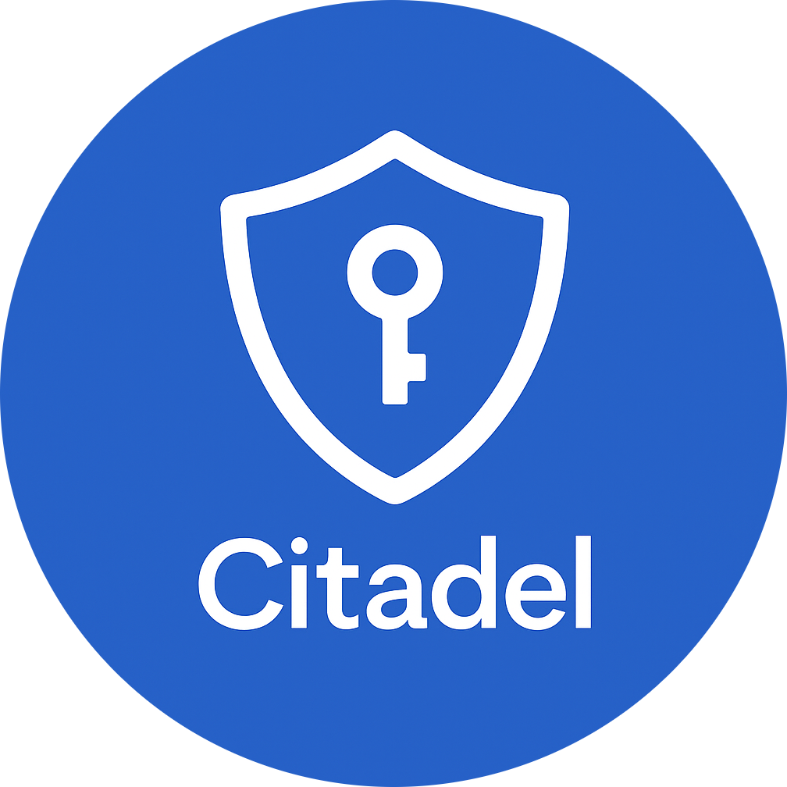

<p align="center">
  
</p>

<h1 align="center">Citadel Vault</h1>

<p align="center">
  <strong>A Modern, Zero-Knowledge Digital Vault</strong><br/>
  Your Digital Fortress, Fortified.
</p>

<p align="center">
  
  
  
  
  
</p>

---

## Table of Contents

- [Overview](#overview)
- [Key Features](#key-features)
- [Architecture](#architecture)
- [Security Model](#security-model)
- [Tech Stack](#tech-stack)
- [Project Structure](#project-structure)
- [Getting Started](#getting-started)
- [Platform Configuration](#platform-configuration)
- [Database Schema](#database-schema)
- [API and Backend](#api-and-backend)
- [Testing](#testing)
- [Team](#team)
- [Acknowledgements](#acknowledgements)

---

## Overview

Citadel Vault is a cross-platform, offline-first password manager built with Flutter. It provides military-grade encryption (Argon2id + AES-256-GCM), a zero-knowledge architecture where the server never has access to plaintext data, and a comprehensive feature set that rivals commercial solutions.

The application serves individuals who need a secure, intuitive tool to store and manage passwords, secure notes, payment cards, identity documents, SSH keys, and encrypted files across all their devices.

### Problem Statement

Over 65% of internet users reuse passwords across multiple accounts (Google Cloud, 2024), and existing solutions are often fragmented, expensive, or rely on weak security primitives. Citadel addresses this by combining best-in-class encryption with a seamless cross-platform experience.

### Client

**Amrit Hamal** -- Director at Everest Double Glazing. Manages sensitive business and personal data across multiple services. Citadel was developed to protect credentials from breaches and ensure security for both client operations and personal information.

---

## Key Features

### Vault Management
- **10 item types**: Passwords, Notes, Cards, Bank Accounts, Contacts, WiFi, Licenses, Identities, SSH Keys, Custom Items
- Per-vault AES-256-GCM encryption with unique derived keys
- Folder organization, favorites, and full-text search
- Multiple vault support (personal + shared)

### Password Security
- **Password Generator** with configurable length, character sets, and passphrase mode
- Real-time entropy calculation and strength visualization
- Crack time estimation (single PC to nation-state supercomputer)
- Password history tracking with change timestamps

### Breach Monitoring (Watchtower)
- **Have I Been Pwned** integration using k-anonymity (passwords never leave the device)
- Email breach monitoring with notification alerts
- Health score (0-100) based on weak, reused, old, and breached passwords
- Breach catalog with timeline visualization
- Dark web monitoring dashboard

### Two-Factor Authentication
- Built-in **TOTP authenticator** (RFC 6238)
- QR code scanning via camera for easy setup
- Auto-copy codes to clipboard on fill
- Encrypted secret storage alongside vault items

### Autofill (Android)
- Native **AutofillService** with inline suggestions
- Domain matching with phishing detection via `DomainComparator`
- Package-based credential lookup
- Auto-copy TOTP code after autofill completion

### Sharing and Emergency Access
- **End-to-end encrypted sharing** via X25519 ECDH key exchange
- HKDF-SHA256 derived keys with domain separation
- Shared vaults with multi-user access control
- Emergency access with configurable time-delayed key release

### Travel Mode
- Soft-hide non-travel-safe vaults instantly
- No data deletion -- all content preserved locally
- Completely offline operation (pull-only sync)
- One-tap activate/deactivate

### File Vault
- Encrypt and store sensitive files (PDFs, images, documents)
- Streaming AES-256-GCM encryption for large files
- Integrated file picker with type validation

### Email Aliases
- **SimpleLogin** integration for email alias creation
- **DuckDuckGo Email Protection** with in-app signup
- Mask real email address across online services

### Import and Export
- CSV import with configurable field mapping
- Encrypted vault backup export
- Migration support from other password managers

### Offline-First Sync
- All writes go to local Drift database first
- Background sync every 30 seconds when online and unlocked
- Push/pull phases with last-write-wins conflict resolution
- Queue-based retry with exponential backoff (max 5 retries)

### Notifications
- Local-only notifications (no cloud push dependency)
- Breach alerts, password expiry reminders
- Emergency access request notifications
- Per-channel Android notification configuration

---

## Architecture

Citadel follows **Clean Architecture** with a **feature-based module structure**:

```
+--------------------------------------------------+
|              Presentation Layer                   |
|       (Widgets, Pages, Riverpod Providers)        |
+--------------------------------------------------+
|                Domain Layer                       |
|          (Entities, Use Cases, Repos)             |
+--------------------------------------------------+
|                 Data Layer                        |
|   (Repositories, Services, Data Sources)          |
+--------------------------------------------------+
|               Infrastructure                      |
| (CryptoEngine, Database, Sync, Secure Storage)    |
+--------------------------------------------------+
```

### State Management

**Riverpod 3.x** with:
- `ConsumerStatefulWidget` for stateful UI components
- `AsyncNotifierProvider` for asynchronous state operations
- `FutureProvider.family` for parameterized queries
- Provider overrides for dependency injection (PocketBase, Database)

### Navigation

**GoRouter** with auth-based redirects and a session state machine:

```
NotAuthenticated --> Locked --> Unlocked
       |                          |
     /login                    /home
     /signup                   /vault-item/:id
     /onboarding               /settings
```

### Data Flow

```
User Action --> Riverpod Provider --> Repository --> Local DB (Drift)
                                                       |
                                                   SyncEngine
                                                       |
                                                  PocketBase (encrypted blobs)
```

---

## Security Model

### Encryption Hierarchy

```
Master Password
    | Argon2id (32MB memory, 3 iterations, 4 parallelism)
    v
Vault Key (256-bit SecretKey)
    | AES-256-GCM (12-byte nonce, 16-byte auth tag)
    v
Encrypted Vault Items
```

### Key Principles

| Principle | Implementation |
|-----------|---------------|
| **Zero Knowledge** | Server stores only encrypted blobs. No plaintext metadata is readable server-side. |
| **Client-Side Encryption** | All encryption and decryption happens on-device before any network transmission. |
| **Key Derivation** | Argon2id with memory-hard parameters (32MB) resistant to GPU and ASIC attacks. |
| **Authenticated Encryption** | AES-256-GCM provides both confidentiality and integrity verification. |
| **Secure Key Exchange** | X25519 ECDH + HKDF-SHA256 with domain separation for shared vault keys. |
| **Phishing Defense** | Domain hash comparison during autofill prevents credential submission to spoofed sites. |
| **Session Security** | Auto-lock on background, inactivity timeout, vault key zeroing from memory on lock. |
| **PIN Rate Limiting** | Exponential backoff: 30s, 60s, 5m, 15m. PIN disabled after 15 consecutive failures. |

### Encrypted Blob Format (v2)

```
[0x02 version][12-byte nonce][ciphertext...][16-byte GCM tag]
```

### Secure Storage by Platform

| Platform | Backend |
|----------|---------|
| Android | EncryptedSharedPreferences (AES-GCM) |
| iOS | Keychain Services with access groups |
| macOS | Keychain with fallback to SharedPreferences for unsigned builds |
| Web | Web Crypto API |

---

## Tech Stack

### Core Framework

| Technology | Version | Purpose |
|-----------|---------|---------|
| Flutter | 3.27.2 | Cross-platform UI framework |
| Dart | 3.7.2 | Programming language |
| Riverpod | 3.3.1 | Reactive state management |
| GoRouter | 17.2.0 | Declarative navigation with auth guards |
| Drift | 2.22.0 | Type-safe SQLite with encryption support |
| PocketBase | 0.23.0 | Backend-as-a-Service (self-hosted) |

### Cryptography

| Technology | Version | Purpose |
|-----------|---------|---------|
| cryptography | 2.7.0 | Argon2id, AES-256-GCM, X25519, HKDF |
| cryptography_flutter | 2.3.2 | Platform-optimized native crypto acceleration |
| pointycastle | 4.0.0 | Additional cryptographic primitives |
| crypto | 3.0.6 | SHA-1 hashing for HIBP k-anonymity lookups |

### Security

| Technology | Version | Purpose |
|-----------|---------|---------|
| flutter_secure_storage | 9.2.4 | OS keychain and encrypted preferences |
| local_auth | 2.3.0 | Biometric authentication (Face ID, Touch ID, fingerprint) |
| http_certificate_guard | 1.0.1 | TLS certificate pinning |
| permission_handler | 12.0.1 | Runtime permission management |

### UI and Design

| Technology | Purpose |
|-----------|---------|
| Google Fonts (Poppins) | Primary typography |
| icons_plus | Bootstrap and line icon sets |
| Lottie | Animated illustrations and transitions |
| Rive | Interactive vector animations |
| cached_network_image | Service logo caching via logo.dev |

---

## Project Structure

```
citadel-vault/
|-- android/                      # Android platform (Kotlin)
|   +-- app/src/main/kotlin/      # AutofillService, InlinePresenter
|-- ios/                          # iOS platform (Swift)
|-- macos/                        # macOS platform (Swift)
|-- web/                          # Web platform
|-- lib/
|   |-- main.dart                 # App entry point with ProviderScope
|   |-- app.dart                  # CitadelApp (session lifecycle, sync)
|   |-- core/
|   |   |-- crypto/               # CryptoEngine (Argon2id + AES-256-GCM)
|   |   |-- database/             # Drift tables, DAOs, AppDatabase
|   |   |-- providers/            # Core Riverpod providers
|   |   |-- session/              # Session state machine, PIN rate limiter
|   |   |-- sync/                 # Offline-first SyncEngine
|   |   |-- storage/              # AppSecureStorage (keychain wrapper)
|   |   +-- network/              # ConnectivityService
|   |-- data/services/
|   |   |-- api/                  # PocketBaseService (AsyncAuthStore)
|   |   +-- auth/                 # AuthService, LocalAuthService
|   |-- features/
|   |   |-- auth/                 # Login, signup, verification providers
|   |   |-- autofill/             # AutofillIndexService, DomainComparator
|   |   |-- email_alias/          # SimpleLogin, DuckDuckGo Email
|   |   |-- file_vault/           # FileEncryptionService
|   |   |-- import_export/        # CSV import, encrypted export
|   |   |-- notifications/        # NotificationService (local-only)
|   |   |-- password_generator/   # Generator with entropy scoring
|   |   |-- search/               # Full-text vault search
|   |   |-- security/             # Watchtower, HIBP, TOTP, breach detection
|   |   |-- sharing/              # SharedVaultService, EmergencyAccess
|   |   |-- ssh_keys/             # SSH key management
|   |   |-- travel_mode/          # Vault soft-hiding
|   |   +-- vault/                # Core vault CRUD, domain entities
|   |-- presentation/
|   |   |-- pages/                # Auth, home, settings, dashboard, splash
|   |   +-- widgets/              # Shared UI components
|   +-- routing/                  # GoRouter configuration
|-- assets/
|   |-- images/                   # App logo, icons
|   +-- animations/               # Lottie JSON files (11 animations)
|-- scripts/                      # Server config, utilities
|-- docs/                         # API docs, UAT scenarios
|-- test/                         # Unit and widget tests
+-- pubspec.yaml                  # Dependencies and configuration
```

---

## Getting Started

### Prerequisites

- Flutter SDK 3.27.2 or higher
- Dart 3.7.2 or higher
- Android Studio (for Android builds, minSdk 26)
- Xcode 15+ (for iOS/macOS builds)
- A PocketBase instance (or use the hosted production server)

### Installation

```bash
# Clone the repository
git clone https://github.com/nehabista/citadel-vault.git
cd citadel-vault

# Install dependencies
flutter pub get

# Generate code (Drift database, asset references)
dart run build_runner build --delete-conflicting-outputs

# Run on a connected device
flutter run
```

### Environment Configuration

```bash
# Use custom PocketBase server
flutter run --dart-define=POCKETBASE_URL=https://your-server.example.com

# Default production server
flutter run
# Uses: https://citadelpasswordmanager.pockethost.io
```

### Building for Release

```bash
# Android APK
flutter build apk --release

# Android App Bundle
flutter build appbundle --release

# iOS
flutter build ios --release

# macOS
flutter build macos --release

# Web
flutter build web --release
```

---

## Platform Configuration

### Android

| Setting | Value |
|---------|-------|
| minSdk | 26 (required for Autofill Framework) |
| compileSdk | 36 |
| targetSdk | 35 |
| Kotlin JVM Target | 17 |
| NDK Version | 27.0.12077973 |

**Native Components:**
- `CitadelAutofillService` -- System autofill provider registered in AndroidManifest
- `AutofillResponseBuilder` -- Constructs fill responses from encrypted vault data
- `InlinePresenter` -- Renders inline autofill suggestion chips

### iOS

| Setting | Value |
|---------|-------|
| Minimum Deployment Target | iOS 16.0 |
| Entitlements | Keychain Sharing, App Groups |
| Frameworks | LocalAuthentication, Security |

### macOS

| Setting | Value |
|---------|-------|
| Minimum Deployment Target | macOS 10.14 |
| Sandbox | Enabled |
| Entitlements | Network Client/Server, File Access, Keychain Groups |

---

## Database Schema

Citadel uses **Drift** (type-safe SQLite) with database-level encryption:

| Table | Purpose | Key Fields |
|-------|---------|-----------|
| `vaults` | Vault metadata | id, name (encrypted), created_at, travel_safe |
| `vault_items` | Encrypted credentials | id, vault_id, encrypted_blob, type, modified_at |
| `password_history` | Previous password versions | id, item_id, encrypted_password, changed_at |
| `totp_entries` | TOTP secrets | id, item_id, encrypted_secret, algorithm, digits |
| `file_attachments` | Encrypted file metadata | id, item_id, encrypted_blob, filename, mime_type |
| `shared_items` | Cross-user item shares | id, item_id, recipient_id, encrypted_key |
| `vault_members` | Shared vault membership | vault_id, user_id, encrypted_vault_key, role |
| `emergency_contacts` | Emergency access config | id, user_id, contact_id, status, delay_hours |
| `notifications` | Local notification log | id, type, title, body, is_read, created_at |
| `sync_queue` | Pending sync operations | id, table_name, record_id, operation, payload |
| `settings` | Key-value configuration | key, value |
| `autofill_index` | Domain/package hash index | item_id, domain_hash, package_hash |

The database encryption key is a randomly generated 256-bit hex string, stored in platform secure storage on first launch.

---

## API and Backend

Citadel uses **PocketBase** as a self-hosted Backend-as-a-Service:

### Collections

| Collection | Description | Access Rules |
|-----------|-------------|-------------|
| `users` | User accounts with email/password auth | Public registration, self-access |
| `vault_items` | Encrypted vault entries | Owner-only (filtered by user_id) |
| `shared_vaults` | Shared vault metadata and membership | Members-only access |
| `sync_metadata` | Sync state tracking per user | Owner-only |

### Sync Protocol

1. **Push Phase**: Local changes (create/update/delete) are sent to PocketBase
2. **Pull Phase**: Server records newer than the last sync timestamp are fetched and merged
3. **Conflict Resolution**: Last-write-wins with local preference
4. **Retry Logic**: Exponential backoff with a maximum of 5 retries per operation
5. **Frequency**: Every 30 seconds when the app is online and the vault is unlocked

All data transmitted over the network is **encrypted client-side before transmission**. The PocketBase server only stores and serves opaque encrypted blobs.

---

## Testing

### Test Strategy
